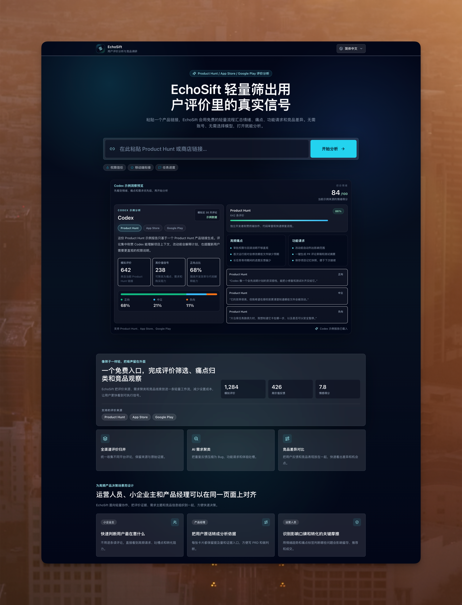

<h1 align="center">
  <a href="https://echosift.online/">EchoSift</a>
</h1>

<p align="center">
  <a href="https://echosift.online/">
    
  </a>
</p>

<p align="center">
  以 Web 应用和 Chrome 扩展轻量筛出 Product Hunt、App Store 和 Google Play 用户评价里的真实信号。
</p>

<p align="center">
  <a href="./README.md">English</a> | <strong>简体中文</strong>
</p>

<p align="center">
  
  
  
  
  
  
</p>

## 项目介绍

EchoSift 是一个轻量级 Web 应用和 Manifest V3 Chrome 扩展，用于把公开产品反馈转化为可用于产品决策的洞察。用户可以在 Web 应用里粘贴 Product Hunt、Apple App Store 或 Google Play 链接，也可以在受支持的产品页面上直接通过 Chrome 扩展发起分析。EchoSift 会抓取近期用户评论或评价，进行统一格式化处理，再通过 AI 分析流程提炼情绪、关键高价值信号、高频痛点、功能请求和代表性用户原话，并以聚焦的仪表盘展示。

本项目采用 Vibe Coding 工作流构建：通过 AI 辅助生成加速实现，同时让产品流程、API 行为和界面体验都以当前代码逻辑为准。

## 功能特性

- 🔗 支持分析 Product Hunt、Apple App Store 和 Google Play 产品链接。
- 🧹 将不同来源的评论和评价统一规范化为共享的评论数据结构。
- 🤖 通过兼容 SiliconFlow 的 OpenAI SDK 客户端生成 AI 辅助的 UX 与产品洞察。
- 📊 使用 Recharts 展示 KPI 卡片、情绪分布和当前情绪快照。
- 🧩 以优先级看板形式组织痛点、功能请求和典型用户声音。
- 🧾 支持展开洞察卡片，查看来自原始抓取数据的支撑评论证据。
- 🧷 支持通过 Chrome 扩展在产品页面内用悬浮按钮一键分析评论。
- ⚡ Chrome 扩展会复用进行中的同页分析请求，并在浏览器会话内缓存成功结果。
- 🌐 支持在简体中文、繁体中文和英文界面之间切换。
- 🛡️ 为分析 API 提供 URL 校验、频率限制、并发限制、请求超时和内存分析缓存。

## 截图

<p align="center">
  <a href="https://echosift.online/">
    
  </a>
</p>

## 技术栈

### 前端

- Next.js 14 App Router
- React 18
- TypeScript
- Tailwind CSS
- Framer Motion
- Lucide React
- Recharts

### Chrome 扩展

- Plasmo
- Chrome Extension Manifest V3
- React 内容脚本界面
- 后台 Service Worker，负责 API 请求、重复请求合并和浏览器会话缓存

### 后端 / API

- Next.js API Routes
- Node.js runtime APIs
- 面向 SiliconFlow 配置的 OpenAI JavaScript SDK
- Product Hunt GraphQL API
- Apple RSS customer reviews API 与 App Store 网页评论 fallback
- `google-play-scraper`

### 数据库

- 当前未使用外部数据库。
- 分析结果通过可配置 TTL 的内存缓存保存。
- 频率限制和并发状态同样保存在内存中，因此多实例生产部署若需要全局限制或持久缓存，建议接入共享基础设施。

### 测试

- Node.js 内置测试运行器
- 针对评论抓取、API 防护、缓存和 AI 分析行为的聚焦测试
- Chrome 扩展独立类型检查和生产构建验证

## 快速开始

### 前置要求

- Node.js 18.17 或更新版本。推荐使用 Node.js 20 LTS。
- npm
- 用于 AI 分析的 SiliconFlow API Key。
- 如果需要分析 Product Hunt 链接，需要 Product Hunt Developer Token。

本项目不需要 Python 运行时，也不需要单独启动后端服务。前端和 API 后端都位于同一个 Next.js 应用中。

### 安装

```bash
npm install
```

### 环境变量

在项目根目录创建 `.env.local` 文件：

```env
# /api/analyze 必需
SILICONFLOW_API_KEY=sk-your-siliconflow-api-key

# 仅 Product Hunt 评论/留言抓取必需
PRODUCT_HUNT_API_TOKEN=ph-your-product-hunt-developer-token

# 可选：评论抓取控制
REVIEWS_MAX_REVIEWS=100
REVIEWS_REQUEST_TIMEOUT_MS=30000
GOOGLE_PLAY_SCRAPER_THROTTLE=10

# 可选：让服务端抓取走本地/系统代理
HTTPS_PROXY=http://localhost:7897

# 可选：在生产环境开放 /api/reviews 调试接口
REVIEWS_API_DEBUG_ENABLED=false

# 可选：分析控制
ANALYSIS_MAX_REVIEWS=150
ANALYSIS_SELECTED_REVIEW_LIMIT=12
ANALYSIS_REVIEW_TEXT_MAX_CHARS=280
ANALYSIS_CACHE_TTL_SECONDS=259200
ANALYSIS_CONCURRENCY_LIMIT=2

# 生产环境必需：持久化异步分析任务
UPSTASH_REDIS_REST_URL=https://...
UPSTASH_REDIS_REST_TOKEN=...
QSTASH_TOKEN=...
QSTASH_CURRENT_SIGNING_KEY=...
QSTASH_NEXT_SIGNING_KEY=...
APP_BASE_URL=https://echosift.online
CRON_SECRET=generate-a-random-secret

# 可选：网页版异步分析任务控制
WEB_ANALYSIS_MAX_REVIEWS=150
WEB_ANALYSIS_SELECTED_REVIEW_LIMIT=12
WEB_ANALYSIS_REVIEW_TEXT_MAX_CHARS=280
ANALYSIS_JOB_TTL_MS=1800000
ANALYSIS_JOB_TIMEOUT_MS=120000
AI_ANALYSIS_TIMEOUT_MS=45000
AI_ANALYSIS_MAX_TOKENS=700
GOOGLE_PLAY_WEB_FALLBACK_TIMEOUT_MS=8000

# 可选：/api/analyze 频率限制
ANALYZE_RATE_LIMIT_MAX_REQUESTS=10
ANALYZE_RATE_LIMIT_WINDOW_MS=60000
```

### Redis 保活定时任务

`vercel.json` 已配置每天调用一次 `GET /api/cron/redis-keepalive`。该路由会
对 Upstash Redis 的固定 key `echosift:redis:keepalive` 做一次写入和读回，
让 Redis 在低流量时期也持续产生轻量命令。

请在 Vercel 环境变量里设置 `CRON_SECRET`。该路由要求请求包含：

```http
Authorization: Bearer $CRON_SECRET
```

Vercel Cron 在配置了 `CRON_SECRET` 后会自动带上这个 header。部署后可在
Vercel cron 日志里确认接口返回 `{ "ok": true }`；如果返回 `503`，说明 Redis
或 cron secret 环境变量未配置正确。

### 本地运行

启动开发服务器：

```bash
npm run dev
```

打开应用：

```text
http://localhost:3000
```

运行测试：

```bash
npm test
```

本地构建并运行生产服务器：

```bash
npm run build
npm start
```

### Chrome 扩展

Chrome 扩展位于 `extension/`，与 Next.js 应用分开构建。它会在受支持的产品页面注入悬浮的 `一键分析评论` 按钮：

- Product Hunt: `https://www.producthunt.com/products/*`
- App Store: `https://apps.apple.com/*/app/*`
- Google Play: `https://play.google.com/store/apps/details*`

第一版会刻意忽略 Product Hunt `/posts/*` 页面。

安装扩展依赖并启动开发构建：

```bash
cd extension
npm install
npm run dev
```

在 `chrome://extensions` 中开启开发者模式，并从 `extension/build/chrome-mv3-dev` 加载生成的开发版扩展。

校验并构建生产版扩展：

```bash
cd extension
npx tsc --noEmit
npm run build
npm run package
```

生产版扩展从 `extension/build/chrome-mv3-prod` 加载。

默认情况下，扩展会请求 `https://echosift.online`，并使用异步分析任务 API：先请求 `POST /api/analyze/jobs`，再轮询 `GET /api/analyze/jobs/{jobId}`。开发或构建时可以覆盖后端地址：

```bash
PLASMO_PUBLIC_API_BASE_URL=http://localhost:3000 npm run dev
```

可选构建期控制项：

```bash
PLASMO_PUBLIC_ANALYSIS_TIMEOUT_MS=120000
PLASMO_PUBLIC_ANALYSIS_CACHE_TTL_MS=1800000
```

## 许可证

本项目基于 MIT License 授权。
